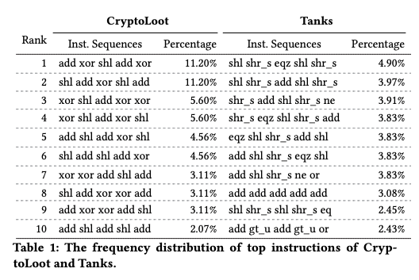
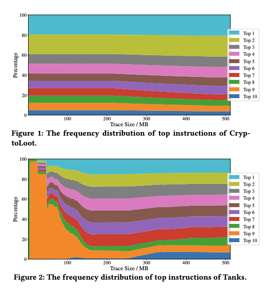

# 恶意代码分析方向

## 题目描述

### 赛题要求

选手将拿到6000个有标记的样本文件，其中标记信息为该样本是否是挖矿样本；此外选手还将拿到6000个未标记的待检测样本文件。选手需要对有标记的数据集进行分析，研究挖矿样本的判定方法，并在此基础上编写程序，从待测试的样本数据集中找出挖矿样本。

选手需提交待测试数据集中每个样本文件的判定结果，文件格式为txt，每行数据为样本名, 1/0，以’\n’ 进行换行。其中，“1”代表该样本是挖矿样本，“0”代表该样本不是挖矿样本。如:

000e44d6ebfb572015549c20047e66c8, 1
000ea8f3cf010b991bb0c566f544cff3, 0
⚠️注意事项1：为避免选手不小心将样本运行起来，我们抹掉了样本PE结构中的MZ，PE，导入导出表等信息；

⚠️注意事项2：选手必须提交所有样本（6000个）的判定结果，如出现答案不完整、答案重复的情况，则答案无效；

### 分数计算方法：

最终得分 = 检出率 - 惩罚因子 * 误报率
检出率 = 黑判黑 / (黑判黑 + 黑判白)，误报率 = 白判黑 / (白判黑 + 白判白)，初赛惩罚因子为0.9
例如：选手检出率为80%，误报率为10%，则其最终得分为80-0.9*10=71分

## binary分析

- 黑白样本的本质区别在于是否为挖矿，白样本中也包含有恶意特征的程序
- 部分程序有加壳，有upx、mpress、vmp和某一种不知名的壳
- 部分程序为.NET语言编写，字符串为utf-16
- 发现部分程序可能由RichEdit脚本语言编写

## 一些idea

- 指令特征
- 字符串特征
- 密码函数识别
- 哈希函数识别
- 加壳binary的识别&脱壳
- 多进程

## 指令特征

挖矿程序与正常程序的区别在于其需要大量的计算操作，前几周看到过一篇CCS'19 Poster的文章：[Poster: Detecting WebAssembly-based Cryptocurrency Mining](https://dl.acm.org/doi/pdf/10.1145/3319535.3363287)，其中使用trace挖矿程序运行时的指令类型，统计其程序在各个运行阶段出现频率最高的指令序列，以次来取得较好的识别效果。

不过在本题中，binary的导入导出表被抹掉，大部分都很难修复运行。这种动态trace的方式就不适用了，而如果单纯静态分析指令Opcode出现频率的话，则会存在较高的误报率。（如静态链接openssl，其中 包含大量的密码学函数，而导致指令类型分布发生变化）因此我们没有使用指令类型的特征来进行分析。

## 字符串特征

- miner (not examiner, terminer)
- stratum
- wallet
- xmrig
- zcash
- bitcoin
- etherum
- coin (not CoInitialize, coincide, Coinmaking, iecompat:softcoin.com)
  - bitcoin litecoin coinbase cryptocoin Crytocoin yacoin coin-miner
- CryptoNight
- monero
- Raum-with-Me，raum_encrypted，RaumWithMe，SamaelLovesMe
- Mongoose
- B0F0F34C576C4FCC89E44A49B193599F
- transactionservices.exe
- supportxmr

## 密码函数识别

我们在初赛的第二天时，尝试只使用aes常量`\x63\x7c\x77\x7b\xf2\x6b\x6f\xc5`进行匹配，得到了89分，虽然存在一定的误报，但显然为一个重要特征。

## 哈希函数识别

哈希函数在挖矿算法中是不可或缺的，根据http://www.bitcoinlion.com/cryptocurrency-mining-hash-algorithms/ 所述，加密货币中主要使用的hash算法有：

- Sha-256
- Script
- X11
- cryptonight

哈希函数在整个挖矿算法中处于一个核心位置，如果我们能够通过哈希函数常量或函数签名的方式识别出哈希函数，继而对其调用时的参数进行数据流、控制流分析，可能可以识别出挖矿算法。然而由于时间原因，我们没有付诸实践。

## 加壳binary的识别&脱壳

可以对PE文件计算信息熵以判断其是否加壳。

主要有四种类型的壳：

- upx，附加赛样本中有942/9017
- mpress，120/9017
- vmp，38/9017
- 某不知名壳，节表首项名称为`"\x20\x20\x20\x00\x20\x20\x20\x20"`，随后两项为随机八个字母。61/9017

由于无法动态跑，我们只能使用静态的方式脱壳。两张方式：脱壳算法、模拟执行。

upx由于导入表被抹去，正常脱壳时会报错，而使用[看雪上的脱壳工具](https://bbs.pediy.com/thread-75652.htm)是不需要修复导入表，且甚至是能脱出可以运行的PE，因此，导入表并不是脱壳的必要条件之一。但是由于我们的运行环境为linux，且看回复说公布源码的版本中还有bug，因此我们需要另寻其他工具。

我们选择使用retdec-unpacker进行脱壳，retdec是一款开源的反编译器，其中也包含了脱壳插件。调试的过程中发现，我们只需要将struct IMAGE_NT_HEADERS NtHeader -> struct IMAGE_OPTIONAL_HEADER32 OptionalHeader -> struct IMAGE_DATA_DIRECTORY_ARRAY DataDirArray -> struct IMAGE_DATA_DIRECTORY Import 中的DWORD VirtualAddress改为一个节表中定义的合法地址即可，观察了部分upx加壳的程序发现其较多指向.UPX2的开始出，然而并不是每个upx程序都要.UPX2，因此我们选择将其改为最后一个名字中包含".UPX"的section，随后使用retdec-unpacker脱壳即可。详见代码 [pe_analyzer.py](./workspace/analyzer/pe_analyzer.py)

对于那某不知名壳，原本以为模拟执行脱壳的工具应该挺多的，但是找了一圈并没有找到，可能是因为API无法模拟的缘故没办法完全脱壳，只好自己造轮子。我们的策略是从entry point开始，模拟执行，尽可能的跑下去，ip跑飞时将内存dump出来分析。详见代码 [packer1_unpacker_x86.py](./workspace/analyzer/packer1_unpacker_x86.py)

## 多进程

充分利用服务器的性能，以加速分析。[\__main__.py](./workspace/analyzer/__main__.py)

## 总结

本次比赛中我们使用了密码学常量检测、特征字符串匹配的方式识别挖矿程序，并处理了大部分加壳程序。但由于只进行了特征匹配，存在较高的误报率。遗憾止步于第六名。

不过我们使用了两种方式脱壳，使得我们能够进行分析的binary比其他队伍更多。

由于时间原因，只是使用了特征匹配，还有一些程序分析的方法并没有付诸实践...